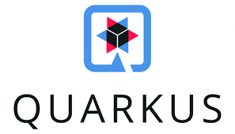
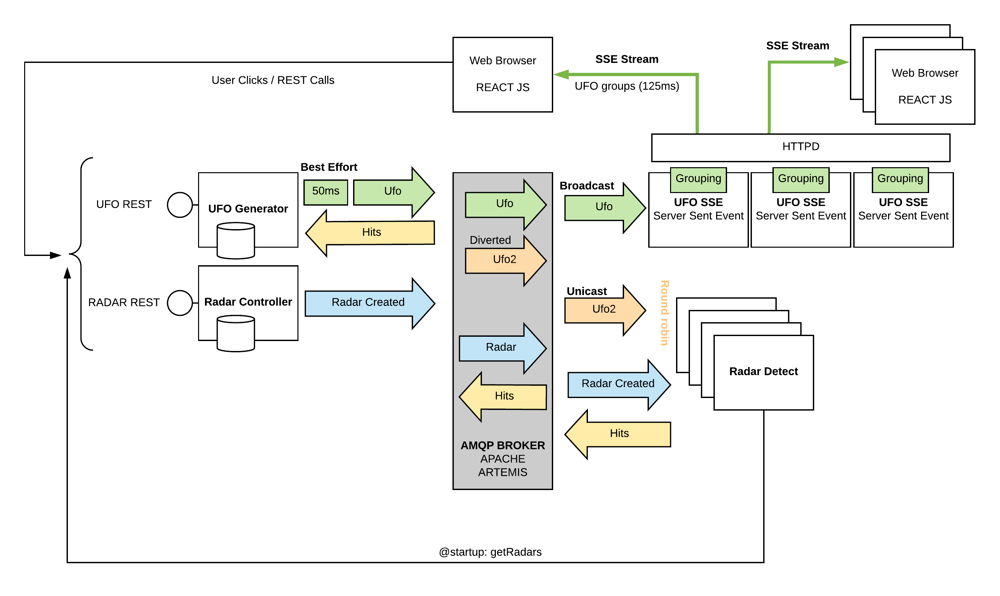
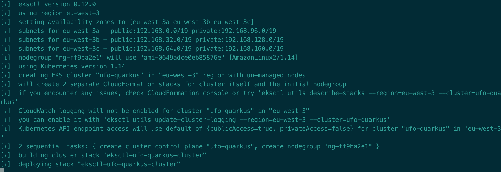
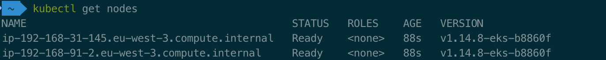
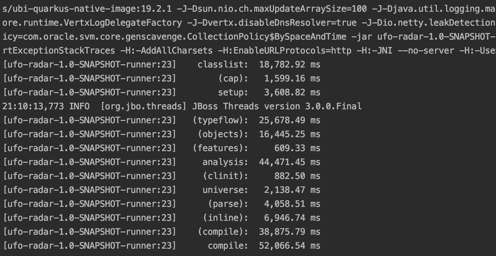
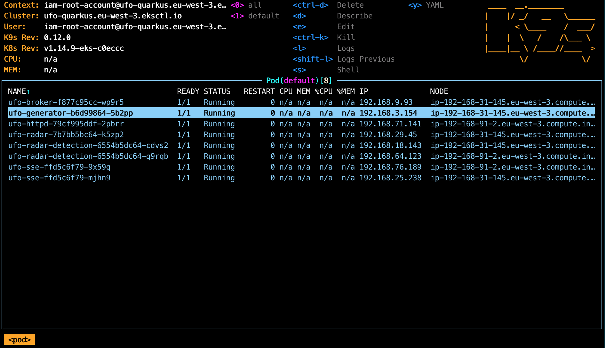
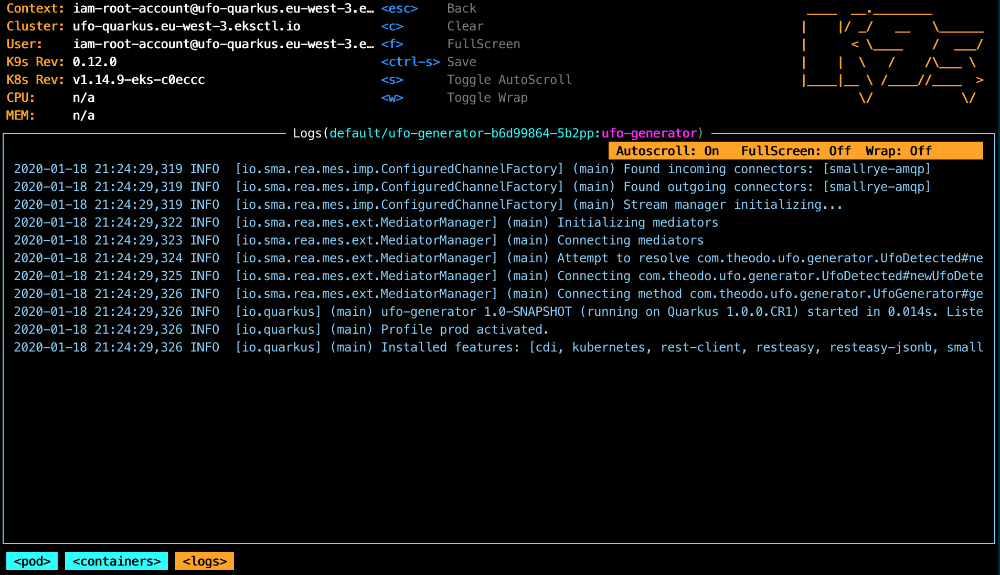
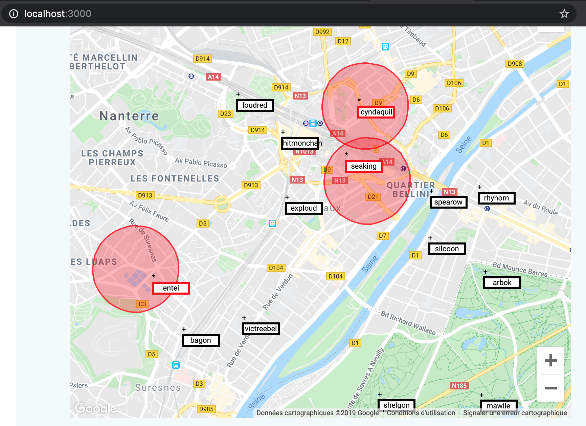

## JAVA QUARKUS DEMO: UFOs versus RADARs  
  

### Purposes  
- Demonstrate usages of Quarkus framework.  (https://quarkus.io/) 
- Demonstrate how to create REST APIs.  (https://quarkus.io/guides/rest-json)
- Demonstrate how to call REST APIs (local or external) (https://quarkus.io/guides/rest-client)
- Use JAVA Reactive Programming (https://smallrye.io/smallrye-reactive-messaging/#_getting_started)
- Produce AMQP messages on topics  (https://quarkus.io/guides/amqp)
- Consume AMQP messages from queues (broadcast or anycast) (https://quarkus.io/guides/amqp)  
- Broadcast SSE (Server Sent Events) to Web browser  (https://quarkus.io/guides/amqp)
- Consume SSE using JS React Application  
- Launch microservices with JVM  
- Launch same microservices with JVM in Dockers containers  
- Launch same microservices without JVM (native mode) in Dockers containers 
- Use SSL in REST APIs 
  
### Story  
- UFOs are created by the users (initial position and destination are random)  
- RADARs are created by the users by clicking on the map  
- When RADARs detect UFOs, UFOs are highlighted on the map  
  
### Architecture  
- Microservice `ufo-generator`: Manage list of UFOs and UFOs positions  
  - Expose REST API to Get all UFOs  
  - Expose REST API to Create (POST) new UFOs in the game  
  - Send UFO new positions every 50ms on an AMQP Topic (broadcasted to many queues) named `ufos`  
  - Created UFOs are named using the /pokemon API (to demonstrate external REST HTTPS Calls)  
For more details on this micro-service see [UFO-GENERATOR README](./ufo-generator/README.md)
  
- Microservice `ufo-radar`: Manage list of RADARs and RADARs positions  
  - Expose REST API to Get all current Radars positions  
  - Expose REST API to Create a new RADAR in the game  
  - Send RADAR creation message on an AMQP Topic (broadcasted to many queues) named `radars`  
For more details on this micro-service see [UFO-RADAR README](./ufo-radar/README.md)

- Microservice `ufo-radar-detection`: Compute Detection  
  - Listen to UFO position messages (listen to `ufos-detection`queue (*))  
  - Listen to RADAR creation messages (listen to `radars` queue)  
  - Detect intersection of RADAR and UFO  
  - Emit an AMQP HIT message for each UFO Detected named `hits`  
  - At startup of the microservice, retrieve the list of current RADARs from `ufo-radar` API.  
Multiple instances of this service can be deployed. A UFO message will be consumed by only one.  
For more details on this micro-service see [RADAR-DETECTION README](./ufo-radar-detection/README.md)
    

(*): `ufos-detection` queue is a queue diverted from `ufos` (broadcasted). A message published on `ufos` queue will be duplicated (by the AMQP broker) to `ufos-detection` In `ufos-detection` this message will be consumed by only one consumer.
See snipets files (in snipets directory) that describe AMQP brokers settings.
  
- Microservice `ufo-sse`: Manage SSE (Server Sent Stream) to Browsers  
  - Expose REST API to Create a new UFO positions STREAM (to the browser)  
  - Listen to UFO position messages (listen to `ufos`queue)  
  - Group UFO position by packet (125ms approx.) to be sent by packet to Browser on SSE  
For more details on this micro-service see [UFO-SSE README](./ufo-sse/README.md)
  
### Architecture Diagram  
  
  
  
### Prerequisites for KUB EKS version

1) Having an AWS account
- Install AWS CLI Version 1. [Install AWS CLI](https://docs.aws.amazon.com/cli/latest/userguide/install-macos.html)
- Configure AWS CLI credential. [Credential](https://docs.aws.amazon.com/cli/latest/userguide/cli-configure-metadata.html)

        aws configure

Fill in the `AWS Access Key ID` and `AWS Secret Access Key`

2) Create an EKS Kubernetes Cluster
- Install `eksctl` tool. [Install eksctl](https://eksctl.io/introduction/installation/)

- Create an EKS cluster

        eksctl create cluster --name ufo-quarkus
    
      

    
3) After creation, you can check the status of the nodes in the cluster using:

        kubectl get nodes

      

4) You can use `k9s` tool to navigate in the cluster (see: `https://github.com/derailed/k9s`)
  
  
WATCH OUT !!!!: 
DO NOT FORGET TO DESTROY YOUR CLUSTER AFTER THE TEST IF YOU DO NOT WANT TO BE CHARGED TOO MUCH BY AWS  

    eksctl delete cluster --name ufo-quarkus
    
Double check in AWS Console if you do not have any ghost EC2 instances, ghost EKS cluster, ghost VPC.
If so, you can use the AWS console to terminate all ghosts components.      
 
### Install and Start JVM Mode
In ufo root directory:

    ./push-docker-jvm.sh  
    ./push-in-kub.sh

##### To start FRONT WebPage  
First Get the Public IP of the HTTPD in EKS:

    kubectl get svc ufo-httpd -o jsonpath='{.status.loadBalancer.ingress[0].hostname}'
    
Copy this address in file  `config-devops.js` (copy of the `config-devops-template.js` file)  
Copy also the Google API KEY for GoogleMap

In ufo-front directory:  
  
    yarn install  
    yarn start
    
Navigate to: http://localhost:3000
You can create radars by clicking in the map.

### Install  NATIVE Mode
You need to have GraalVM installed on your computer.
See here: [https://www.graalvm.org/](https://www.graalvm.org/)

This is the Quarkus NATIVE way of deploying application. 
The build phase will create an EXECUTABLE file (including an embedded application server). This is not JAVA anymore.
The deploy phase is based on a LINUX docker image (fedora-minimal). The binary application is put inside the container. 

    ./push-docker-native.sh  
    ./push-in-kub.sh

  

### Explore KUB Pods using K9S

  
  

Native `ufo-generator` application startup in less than 7ms.

##### To start FRONT WebPage  
First Get the Public IP of the HTTPD in EKS:

    kubectl get svc ufo-httpd -o jsonpath='{.status.loadBalancer.ingress[0].hostname}'
    
Copy this address in file  `config-devops.js` (copy of the `config-devops-template.js` file)  
Copy also the Google API KEY for GoogleMap

In ufo-front directory:  

    yarn install  
    yarn start
Navigate to: http://localhost:3000
You can create radars by clicking in the map.

  
